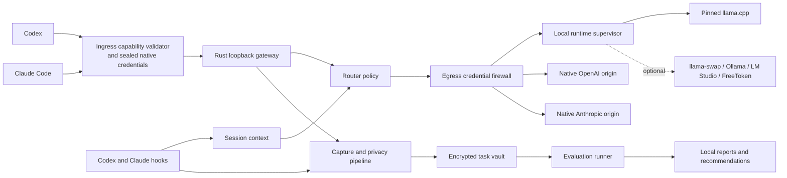

# Local Agent Optimizer: Product Vision and System Architecture

Research snapshot: 23–26 August 2026

Status: decision-complete product blueprint

Working title: Local Agent Optimizer

## 1. Executive summary

Local Agent Optimizer is an open-source, private performance-and-learning layer for coding agents. A user installs it once, continues launching Codex or Claude Code exactly as before, and receives a modest immediate benefit: a small, conservative subset of suitable work is served by a local model while difficult, risky, or unsupported work continues through the user's existing native cloud path.

The product then becomes more useful with evidence. With consent, it saves a small number of valuable and reproducible coding tasks, including their repository starting state and deterministic outcomes. Those tasks become a personal evaluation suite. When a new local or proprietary model appears, the product can replay an approved subset, compare verified results, and report whether the new model is actually better for this user, on this hardware, with this coding harness.

Longer term, the same user-owned evidence can improve routing and, under explicit consent and strict provenance rules, support local LoRA or QLoRA adapters. The user should not need to follow model releases, quantization formats, inference flags, or benchmark methodology.

The product should not be marketed as another model router. That category is crowded. Its durable value is the closed evidence loop:

1. Measure the hardware and workload.
2. Select and benchmark a safe local configuration.
3. Divert only work that is likely to succeed.
4. Observe verified outcomes without changing the user's harness.
5. Preserve reproducible personal tasks.
6. Evaluate model changes using those tasks.
7. Improve recommendations and routing from evidence.
8. Optionally personalize a local model using eligible user-owned data.

The initial promise is intentionally modest: preserve the native experience, reduce cloud or quota consumption by at least a single-digit percentage, do not materially reduce task success, and learn enough to make later model decisions evidence-based.

## 2. Product thesis and candid assessment

### 2.1 Why the idea makes sense

The proposal combines several benefits that are independently valuable:

- Privacy: suitable prompts and code can remain on the machine.
- Cost and quota preservation: easy work need not consume metered API tokens or limited subscription capacity.
- Offline capability: bounded work can continue without a network after installation.
- Better hardware utilization: existing Apple Silicon, CPU, gaming GPU, or workstation resources become useful without manual model engineering.
- Personal evidence: recommendations are based on the user's repositories and task distribution instead of generic leaderboards.
- Continuous verification: new model versions can be tested against stable tasks rather than adopted on marketing claims.
- Progressive personalization: user-owned corrections, accepted patches, and local trajectories can eventually improve a local model.

The strongest user is a developer who already likes Codex or Claude Code, has useful local hardware, cares about privacy or quota, and does not want to replace the agent harness.

### 2.2 Why a generic router is not enough

Several active projects already provide gateways or routing. The August 2026 comparison uses them as conformance references, not runtime dependencies:

| Project | Strength | Gap relative to this product |
|---|---|---|
| [Claude Code Router](https://github.com/musistudio/claude-code-router) | Broad Claude/Codex/provider routing, translation, profiles, UI | Large Node/Electron surface; broad credential reach and optional body logging are outside LAO's privacy target |
| [LiteLLM](https://github.com/BerriAI/litellm) | Widest endpoint/provider coverage, tools, local providers, mature routing | Broad gateway, Python SDK, Rust core, and UI surface; its agent wrappers and virtual keys differ from LAO's native-account target |
| [Codex Router](https://github.com/duolahypercho/codex-router) | Closest Codex precedent; native harness, HTTP/SSE, compact, local providers, rollback | Codex-specific JavaScript/Python stack; no personal evaluation loop or automatic difficulty routing |
| [Bifrost](https://github.com/maximhq/bifrost) | Fast Go gateway, Responses/Messages/tools, Ollama, four-tier routing | Large enterprise surface; Codex requires a virtual key and content logging needs careful independent disabling |
| [Portkey Gateway](https://github.com/Portkey-AI/gateway) | Mature provider gateway, governance, Responses/Messages streaming | API-key and hosted-observability model; no hardware orchestration or comparable Codex compatibility proof |
| [llama-swap](https://github.com/mostlygeek/llama-swap) | Cross-platform inference process lifecycle and model swapping | Useful runtime adapter; does not own client integration, consent, routing evidence, or evaluation |

LAO is in the correct technical category, but it is not more capable today. Established gateways lead on protocol breadth, providers, retries, transformations, UI, and production use. Its intended differentiation is narrower: a small low-level control plane, capture-off privacy defaults, narrow credential ownership, hardware-aware local admission, and a personal reproducible evaluation loop. Most of that remains planned. Until real subscription and API-key smoke tests pass, native-account preservation remains a design with synthetic evidence rather than a shipped advantage.

The defensible layers are personal task evidence, reproducible evaluation, hardware-to-experience selection, trustworthy invisibility, and execution-grounded learning. Protocol translation and inference kernels are replaceable infrastructure.

### 2.3 Product risks

- A local model may support a protocol yet still fail tool calls or long agent trajectories.
- Flat-rate subscriptions weaken the direct money-saving argument; quota, privacy, offline use, and evidence remain valuable.
- Transparent client protocols and subscription behavior can change.
- A gateway sits on a highly trusted path and can leak credentials if route classification and auth handling are coupled.
- Repository replay is difficult: prompts alone are not coding tasks.
- Proprietary-model terms can restrict automated access and use of outputs for competing model training.
- The local model landscape changes too quickly for a hard-coded recommendation.
- Cross-platform support, especially Windows plus AMD and heterogeneous GPU systems, is a substantial compatibility burden.

### 2.4 Go, pivot, and stop criteria

Proceed if the security gates pass and the proof of concept reduces cloud usage by at least 5 percent without more than a two percentage-point loss in verified task success.

Continue as a research preview if security is sound but the local diversion rate or learning benefit is not yet statistically clear.

Pivot to a personal model-evaluation advisor if users value the reports but disable live routing.

Pivot to cloud-model optimization if local models repeatedly fail context, tool, or latency gates but personal evidence still improves cloud selection.

Stop the transparent gateway approach if client protocol churn makes native authentication or UX preservation unreliable.

Do not expand into automatic tuning unless clean training eligibility and held-out improvement can be demonstrated.

## 3. User experience

### 3.1 Installation

The desired interaction is one command:

    lao install

The installer:

1. Detects Codex, Claude Code, existing local endpoints, Git, and supported hardware.
2. Explains the exact files and settings it proposes to manage.
3. Asks at most two optional questions:
   - Resource mode: Auto, Light, or Maximum.
   - Model preference: recommended model, existing endpoint, or preferred model/checkpoint.
4. Downloads a signed binary and one verified prequantized model candidate.
5. Benchmarks the exact model, quantization, engine, context, and device.
6. Installs loopback-only routing and asynchronous client hooks.
7. Verifies local and native-cloud paths without modifying credential stores.
8. Commits the configuration transaction only after smoke tests pass.

If questions are skipped, Auto and the recommended model are used. The installer must support a dry run, byte-for-byte backup, rollback, repair, and conflict-aware uninstall.

### 3.2 Normal use

After installation, the user continues to run:

    codex

or:

    claude

There is no replacement REPL, nested agent, mandatory MCP delegation, or new permission model. The original client remains responsible for its terminal UI, tools, approvals, context handling, and agent loop.

The overlay remains silent during normal success. Route explanations, local success, resource use, and learned evidence are available through status and report commands. It interrupts only when a user policy cannot be honored or when a destructive recovery requires a decision.

### 3.3 Initial routing posture

Cloud remains the conservative default. In the proof of concept, local routing is limited to approximately the easiest 5–15 percent of bounded, low-risk work:

- documentation and comment edits;
- simple repository questions;
- mechanical renames with a verifier;
- test scaffolding;
- narrow formatting or boilerplate changes;
- bounded fixes that have an immediate deterministic test.

Security, authentication, cryptography, destructive migrations, production infrastructure, broad architecture, ambiguous multi-file work, unsupported media, and irreversible external effects route to cloud.

The product should prefer a small reliable improvement to a large speculative diversion rate.

### 3.4 User controls

The following controls are required:

- global Hybrid, Cloud only, and Local only modes;
- per-repository Always cloud, Local only, or pinned-model rules;
- pause routing without uninstalling;
- pause capture independently from routing;
- inspect the last route decision and reason codes;
- inspect, pin, export, or delete captured tasks;
- preview model downloads, memory use, context, and expected speed;
- roll back a model, router policy, or client configuration;
- uninstall without losing unrelated user settings.

## 4. Resource modes and model preference

### 4.1 What the modes control

The modes constrain the entire inference working set: model weights, KV cache, compute buffers, backend allocations, and safety headroom. They also constrain CPU threads, process priority, context, batch size, disk cache, and residency.

GPU utilization percentage cannot be enforced reliably across Metal, CUDA, HIP, and Vulkan. The product therefore guarantees memory and scheduling policies and reports observed GPU utilization instead of promising a hard GPU percentage.

Memory is budgeted independently for every physical pool p:

- T-p is the capacity of that pool.
- A-p is the allocation headroom measured immediately before admission.
- R-mode,p is the OS, display, and foreground-work reserve for that mode and pool.

The non-negative admission budget is:

    B-p = max(0, min(profile fraction × T-p, A-p − R-mode,p))

Apple unified memory is one pool and is never counted again as separate GPU memory. On a discrete GPU, VRAM and host RAM are separate constrained budgets; an offload FitPlan must satisfy both and may never add them together as if they were interchangeable.

Admission is calculated during setup and repeated immediately before every cold model load. The worker is evicted when live pressure invalidates the budget.

| Mode | User-facing promise | Maximum inference allocation | CPU policy | Context target | Residency | Disk policy |
|---|---|---|---|---:|---|---|
| Light | Stay out of the way | min(25% of T, A minus max(8 GiB, 35% of T)) | At most 25% of logical CPUs, capped at 4 threads, low priority | 32K | Unload after 2 idle minutes and immediately on pressure | One artifact normally at most 6 GiB; 12 GiB total cache |
| Auto | Recommended balance | min(45% of T, A minus max(8 GiB, 30% of T)) | At most 50% of logical CPUs, normal-low priority | 64K | Unload after 5 idle minutes and adapt to pressure, battery, and thermal state | One artifact normally at most 16 GiB; 24 GiB total cache |
| Maximum | Strongest practical local option while retaining an OS reserve | min(70% of T, A minus max(6 GiB, 15% of T)) | Up to 90% of logical CPUs while active | 128K where supported | May remain resident only after explicit opt-in; pressure eviction still wins | Confirm any artifact above 32 GiB and show total cache impact |

Illustrative resolved ceilings when A initially equals T; reserve binding explains the 16 GiB Maximum value:

| Machine memory | Light | Auto | Maximum |
|---:|---:|---:|---:|
| 16 GiB | about 4 GiB | about 7.2 GiB | about 10 GiB |
| 24 GiB | about 6 GiB | about 10.8 GiB | about 16.8 GiB |
| 32 GiB | about 8 GiB | about 14.4 GiB | about 22.4 GiB |
| 64 GiB | about 16 GiB | about 28.8 GiB | about 44.8 GiB |
| 128 GiB | about 32 GiB | about 57.6 GiB | about 89.6 GiB |

These numbers are ceilings, not promises to allocate the full amount. Current free memory, Metal working-set limits, display-GPU reserve, cgroup limits, battery state, thermal pressure, and actual llama.cpp fitting can reduce them.

### 4.2 Model classes

The catalog changes over time, so model names are illustrative and date-stamped. Setup displays the exact selected artifact and measured result.

| Available inference budget | Typical candidate class | Illustrative current examples |
|---:|---|---|
| 2–4 GiB | 1.5–4B, Q4/Q5 | compact Qwen-family coding or instruct models |
| 4–8 GiB | 4–8B, Q4/Q5 | Qwen 3.x 4B–8B or a verified coder-specialized equivalent |
| 8–16 GiB | 8–14B, Q4/Q5; some small MoE | Qwen coder/instruct 7B–14B class |
| 16–24 GiB | roughly 14B dense or 30B-A3B-class sparse/MoE, Q4-class | only configurations whose full resident weights, KV, and buffers pass an isolated load |
| 24–32 GiB | 14–32B dense or larger sparse/MoE, Q4-class | 30–32B dense models generally fit only near the upper end |
| 32–64 GiB | 32B dense, larger sparse/MoE, or higher-fidelity quantization | catalog-ranked model with measured long-context and tool reliability |
| Above 64 GiB | large dense or MoE configurations | Maximum-mode workstation candidates, potentially through a specialized backend |

Model parameter count is not the selection rule. Active parameters affect compute speed, but total resident weights still drive fit. Memory topology, quantization, configured-context KV cost, prompt throughput, decode speed, tool validity, license, and personal eval results all matter.

### 4.3 Performance gates

There is no universal industry threshold for usable coding inference. The initial product defaults are:

| Experience target | Median warm decode | 8K-prompt time to first token | Cold readiness |
|---|---:|---:|---:|
| Quality | at least 8 tokens/sec | at most 60 sec | at most 120 sec |
| Balanced | at least 15 tokens/sec | at most 30 sec | at most 60 sec |
| Fast | at least 25 tokens/sec | at most 15 sec | at most 30 sec |

Auto targets Balanced and accepts Quality only when the catalog evidence predicts a meaningful capability gain. Light prefers Fast or Balanced. Maximum may use Quality.

Every active configuration must:

- allocate its selected configured context without OOM and with at least 2K output reserve;
- pass at least 19 of 20 deterministic tool-call fixtures at temperature zero;
- pass Responses and Messages streaming fixtures;
- use 20 timed decode repetitions after warm-up and keep the tenth-percentile result above 70 percent of the selected floor;
- pass long-context retrieval and tool-use fixtures at the maximum context the router may send locally;
- record the hardware, artifact, template, engine build, flags, and full benchmark.

A configuration below 8 output tokens/sec is not used automatically for interactive coding. The user may force it in Local only mode after seeing the warning.

### 4.4 Respecting model preference

Resource mode constrains execution; it does not silently override preference.

Setup offers:

1. Use the recommendation.
2. Reuse an installed local endpoint or artifact.
3. Pin a preferred model family or checkpoint.

If the preferred model fits and passes certification, it is used even when another model has a higher generic ranking. Automatic routing requires the exact artifact, template, backend, engine build, flags, and device fingerprint that was certified. A changed external endpoint or runtime invalidates the evidence and triggers re-benchmarking.

If it can fit only with a different quantization, context, or resource mode, the product shows the exact change and its implications. It never silently substitutes a checkpoint, lowers context, or changes quantization.

If it cannot fit, the user can raise the resource mode, select a smaller verified configuration, or retain the model for manual use. A revoked, expired, or incompatible recipe cannot be auto-routed despite a pin; the escape hatch is an explicit one-task Local only override with a warning.

The context value in each resource mode is a selection target, not permission to lower it silently. If the chosen model cannot satisfy it, the product selects a smaller certified candidate, asks for an explicit profile/context change, or remains on cloud.

Recommendations may change only after a report explains the measured benefit and the user accepts promotion.

## 5. Technology and build strategy

### 5.1 Engineering economy

The north star for every contributor and agent is the simplest elegant solution that works. Simplicity and fast iteration are product requirements, not style preferences; they never excuse weakening correctness, security, privacy, or the explicit component boundaries.

- Use the least code that delivers a working vertical slice and preserves the explicit component boundaries.
- Future-proof with small contracts, owned state, conformance fixtures, and replaceable adapters—not speculative frameworks, generic plugin systems, or layers without a current use.
- Prefer a maintained existing component for the proof of concept when it satisfies the security, license, resource, and compatibility gates. Pin it and hide it behind an interface so an owned implementation can replace it later.
- Do not expose upstream types, paths, configuration, or lifecycle assumptions across our contracts. Reuse must remain replaceable.
- Keep package, type, command, field, and task names short, stable, and unambiguous in their namespace. Avoid repeated suffixes such as Manager, Service, Controller, Implementation, or Component.
- Comments explain security invariants, non-obvious constraints, and upstream quirks. They do not narrate clear code. Diagrams are preferred when they express component relationships more compactly than prose.
- Delete or consolidate code before introducing another abstraction. A component boundary is valid; parallel internal frameworks for hypothetical futures are not.

The goal is minimum total system complexity, not minimum files. Small independent packages and a few explicit adapters are acceptable when they prevent hidden coupling; duplicated wrappers and premature extensibility are not.

### 5.2 Language boundary

The trusted always-on core is Rust:

- installer and transactional configuration manager;
- loopback gateway;
- credential firewall;
- router and session state;
- hardware probe and memory admission;
- model catalog and artifact manager;
- llama.cpp process supervisor;
- capture pipeline and encrypted vault;
- evaluation orchestration and report generation;
- CLI and local status API.

C/C++ remains in pinned upstream llama.cpp binaries or a narrowly wrapped binding.

Python is optional and process-isolated:

- Harbor or Inspect evaluation adapters;
- MLX-LM, Unsloth, or Axolotl training;
- ACRouter research experiments;
- optional FreeToken inference.

All optional processes communicate through versioned JSON or JSONL contracts. The default installation has no resident Python runtime.

### 5.3 Why an independent Rust control plane

The initial investigation favored forking Claude Code Router. Deeper review and the user's low-level-language and low-resource preferences change the target decision:

- Build a thin independent Rust control plane.
- Use official protocol documentation and observed supported-client behavior as authoritative. Treat Claude Code Router only as a differential reference, and use synthetic or provenance-reviewed fixtures rather than captured production logs.
- Port only narrowly reviewed ideas or code with attribution.
- Allow a time-boxed CCR compatibility sidecar behind an interface if protocol work threatens the proof-of-concept schedule.
- Do not ship that sidecar as the intended default architecture.

This avoids inheriting an Electron UI, generic provider marketplace, credential-import surface, broad logging behavior, and a large Node runtime. It also makes a sub-100 MiB idle daemon target realistic.

The repository remains MIT licensed, matching the user's selected open-source posture. Apache-2.0 dependencies and references must retain their notices; no Apache-licensed code is copied without compliance.

### 5.4 Contract-first modular monorepo

Use one monorepo initially, but do not build a monolith. Every strategic component exists from the first implementation wave as an independently buildable and testable package, even when its first implementation is only a disabled stub or an in-memory reference implementation.

The repository boundary is not the architecture boundary. A separate repository would add version coordination, cross-repository release work, and slower atomic security fixes while the contracts are still changing. A modular monorepo gives the project shared conformance fixtures and atomic contract-plus-consumer changes without permitting implementation coupling. A component may move to its own repository later without redesign when it has a genuinely independent release cadence, security ownership, contributor community, or downstream consumers.

The dependency rule is strict:

    applications -> service implementations -> APIs
                                  applications -> APIs

- APIs are owned, versioned packages containing immutable data transfer objects, traits, error taxonomies, and capability negotiation. They contain no service implementation code.
- Service implementations may depend on APIs, never on another service implementation.
- Application composition roots are the only packages allowed to select and connect concrete implementations.
- A stateful component owns its schema, migrations, encryption policy, and retention. No component reads another component's database, files, environment variables, or private types.
- Cross-component values are owned messages or opaque capability/artifact handles. There is no shared mutable state and no raw-path shortcut around an API.
- Deferred systems such as training, artifact optimization, and alternative runtimes have an owning API boundary from the beginning. Adapter code appears only when its spike defines real operations, so placeholders do not become speculative frameworks.
- Shared utility packages are created only after real duplication and at least two current consumers prove the need.

Hot-path components may be linked into the same daemon to minimize latency and idle memory, but they still communicate only through contract traits. Security-, crash-, language-, and lifecycle-sensitive components run as separate workers behind the equivalent versioned RPC contract. Contract tests must prove that linked and RPC implementations have the same observable behavior.

The semantic Rust contract is canonical. The draft out-of-process projection is authenticated, length-prefixed, typed JSON over Unix-domain sockets on macOS/Linux and named pipes on Windows. It allows one call per connection and caps control frames at 1 MiB. Deadlines, idempotency, and semantic cancellation remain undefined until a later spike proves them. This avoids an HTTP/2, protobuf-codegen, and multiplexing stack before the product has a gRPC consumer. Protobuf remains a replaceable wire adapter if independent non-Rust releases, remote RPC, or measured JSON cost later justify it. Standard model traffic continues to use supported Responses and Messages HTTP interfaces. Optional Python batch workers use the same versioned JSON/JSONL semantics and never become an alternate private API into the core.

This section is the canonical architecture decision. The implementation plan carries its executable checks and extraction gate; do not create a second copy in a separate design document.

### 5.5 Reference projects

[shoehorn](https://github.com/notactuallytreyanastasio/shoehorn) demonstrates exact-fit, importance-matrix-guided GGUF quantization in Rust. Its budget calculation and visual explanation are valuable. It is not part of default onboarding because downloading full-precision weights and quantizing them can consume tens of gigabytes and substantial time. Add it later as an Advanced or Maximum-mode optimizer.

[Magnitude](https://github.com/magnitudedev/magnitude) validates a Rust supervisor around llama.cpp, pre-download fit previews, live load admission, and pressure eviction. It is a complete alternative agent, so it should inform boundaries rather than replace Codex or Claude Code.

[FreeToken](https://github.com/FlashML-org/FreeToken) demonstrates large-MoE serving through CPU/GPU co-execution and elastic expert caching. It currently targets modern NVIDIA Windows/Linux environments and a Python/CUDA stack. Treat it as a post-v1 Maximum-mode backend, not a default dependency.

[llmfit](https://github.com/AlexsJones/llmfit) can provide advisory hardware/model candidate ranking. The signed catalog, llama.cpp fit, and real-device benchmark remain authoritative.

[llama-swap](https://github.com/mostlygeek/llama-swap) is the preferred v1 lifecycle sidecar if native supervision becomes insufficient for multi-model use. It remains behind a ManagedRuntime boundary.

## 6. System architecture

Deployment is deliberately different from package ownership:

- `lao-daemon` is the lightweight always-on composition root for gateway, authentication, routing, and control packages.
- llama.cpp or another inference runtime is always supervised as a separate process.
- four tiny least-authority workers run capture, vault, evaluation, or training only when their explicitly enabled workflow needs them.
- the CLI is a separate client of the authenticated local control contract.

This preserves a small idle footprint without collapsing independently owned components into one codebase or one failure domain.

### 6.1 Core interfaces

The implementation must keep the public boundaries stable. Each public interface below lives in a versioned contract package; its concrete implementation lives elsewhere. A component may not import a sibling implementation, and only an application composition root may wire implementations together:

- ClientAdapter: detect, configure, verify, pause, and restore Codex or Claude Code; register hooks and correlate sessions.
- Gate: expose only sanitized TaskContext and an immutable RouteDecision boundary; credential sealing and egress materialization remain private ordered stages inside `svc/gate`.
- RouterPolicy: accept TaskContext and return an explainable RouteDecision.
- ManagedRuntime: prepare, start, health-check, benchmark, cancel, and stop a product-owned model process.
- ExternalEndpoint: probe, fingerprint, health-check, benchmark, and send requests without pulling, deleting, stopping, or reconfiguring user-owned Ollama or LM Studio instances.
- HardwareProbe: expose normalized static hardware, dynamic pressure, backend visibility, and accelerator memory topology.
- ModelCatalog: return signed and revocable manifests, licenses, compatibility, artifacts, and quality priors.
- ArtifactManager: preview, download, verify, cache, promote, roll back, and remove model artifacts.
- Capture: expose only classified/redacted artifacts or opaque references; raw ingress, scrub, snapshot, and commit remain private ordered stages inside `svc/capture`.
- ArtifactStore: reject unclassified plaintext, encrypt metadata and blobs, enforce retention, export, and delete.
- EvalRunner: reconstruct a task, run a pinned agent in isolation, collect verifiers, and produce comparable trials.
- Trainer: prepare eligible data, launch an optional training backend, evaluate an adapter, and support explicit promotion and rollback.
- ArtifactOptimizer: transform an approved source artifact into a separately identified candidate artifact and emit provenance, resource estimates, and verification evidence without mutating the active artifact.

### 6.2 Central records

ModelManifest contains:

- immutable source revision and artifact hashes;
- model family, architecture, total and active parameters;
- artifact format, quantization, and file size, including backend-specific GGUF, safetensors, or reviewed native formats;
- native and minimum usable context;
- Responses, Messages, tool, reasoning, parallel-tool, and vision capabilities;
- license and acceptance requirements;
- minimum and maximum tested llama.cpp builds;
- template hash and backend support;
- benchmark and personal-quality priors;
- revocation and expiry state.

RouteDecision contains:

- task-run identifier;
- Local or Native cloud route;
- selected model;
- difficulty and independent risk classification;
- confidence and reason codes;
- policy version;
- stickiness boundary;
- permitted recovery action.

TaskBundle contains, subject to provider-policy retention eligibility:

- schema version and keyed identifiers;
- client, harness, model, route, and policy versions;
- user instruction as an encrypted artifact;
- exact sanitized working-tree snapshot within its declared capture boundary;
- staged and unstaged state;
- environment fingerprint;
- optional redacted trajectory and final patch for eligible local-model tasks;
- content-free aggregates and hashes for proprietary-model tasks until a reviewed provider policy permits more;
- verifier results;
- user acceptance or rating;
- timing, token, cost, and failure metadata;
- artifact-level transitive provenance DAG, privacy, retention, eval split, and training eligibility.

EvalCampaign contains:

- exact task subset;
- candidate models and pinned harness;
- trial repetitions and randomized order;
- network and sandbox policy;
- time, token, tool, concurrency, and spend caps;
- exact initial-payload digest plus maximum permitted file manifest, data classes, tool scope, and network scope;
- authenticated approval digest and expiry;
- provider-policy decision.

EvalReport contains:

- task-level and per-model results;
- paired success deltas and confidence intervals;
- critical regressions;
- latency, tokens, cost, tool errors, and termination reasons;
- evidence grade;
- promote, category-promote, keep, reject, or collect-more recommendation;
- limitations and reproducibility manifest.

## 7. Client integration and credential safety

### 7.1 Codex

Codex supports custom providers and local providers through its configuration. The narrow compatibility path uses a managed custom provider named `lao`, a non-secret loopback `/oai` prefix, `requires_openai_auth = true`, `supports_websockets = false`, and a separate `X-LAO-Key` caller header. This lets Codex reuse its current native authentication without LAO reading auth storage, while the private caller token authenticates payload requests to the local gateway. Codex 0.146.0 has synthetically proven this HTTP/SSE shape with a fake native credential and a separate caller token. A real ChatGPT-subscription pass-through remains an explicit later smoke test. Treat all of this as version-gated compatibility, not a permanent provider guarantee. The user-level setting is also visible to the Codex IDE extension. See the [Codex configuration reference](https://developers.openai.com/codex/config-reference/) and [Codex hooks](https://developers.openai.com/codex/hooks/).

Never read, copy, or persist Codex auth files. Determine auth mode through a supported client status or behavior check. Install only managed configuration and hooks.

### 7.2 Claude Code

Claude Code officially supports gateways through `ANTHROPIC_BASE_URL`. Setting that URL without another provider credential preserves the saved claude.ai login. LAO adds a separate caller token through `ANTHROPIC_CUSTOM_HEADERS`, not through `ANTHROPIC_AUTH_TOKEN`, `ANTHROPIC_API_KEY`, or a credential helper. Claude Code 2.1.223 has synthetically proven that native bearer auth and `X-LAO-Key` coexist on Messages SSE requests, but current official documentation declares custom headers supported from 2.1.227. Production support therefore requires a fresh 2.1.227-or-later probe. Its exact bodyless `HEAD /ant/api/hello` probe carries neither header, so the gateway allows only that inert probe without caller authentication; every payload endpoint requires the token. Preserve the Anthropic protocol/OAuth capability carried in `anthropic-beta` and unknown protocol fields only on the exact native Anthropic route. See the [gateway subscription rules](https://code.claude.com/docs/en/llm-gateway), [environment-variable reference](https://code.claude.com/docs/en/env-vars), [gateway protocol](https://code.claude.com/docs/en/llm-gateway-protocol), and [hooks](https://code.claude.com/docs/en/hooks/).

Never import Claude credentials from files or keychains. Preflight existing `ANTHROPIC_API_KEY`, `ANTHROPIC_AUTH_TOKEN`, `apiKeyHelper`, custom headers, workload-identity/provider settings, and shell-level base-URL overrides. Do not delete them silently and do not claim subscription preservation when effective precedence selects another credential. A custom base URL disables Remote Control, and some nonessential, fast-mode, and WebFetch traffic may bypass the model gateway. Technical gateway support is not blanket legal authorization to relay subscription credentials; broad support requires a product/legal review of the local user-controlled design.

The installed synthetic probes cover `codex exec` and Claude Code `--bare --print` only. The planned PoC target remains Codex CLI/TUI and Claude Code CLI, but those surfaces require their own smoke tests. This is not configuration isolation: Codex shares its user config with the IDE extension, and Claude user settings can reach background agents. Codex desktop/cloud, Claude IDE/VS Code, Claude Desktop, Remote Control, web, Slack, and other background surfaces require separate adapters and tests.

### 7.3 Local caller capability

Authenticate Codex and Claude Code to the local gateway with different random 256-bit `X-LAO-Key` values. Keep the URL prefixes short and non-secret:

    http://127.0.0.1:PORT/oai
    http://127.0.0.1:PORT/ant

Validate the caller header in constant time before reading a payload body, then strip it before routing. Reject missing, wrong, duplicate, cross-client, or conflicting values. Bind only to loopback, validate `Host`, expose no CORS surface, and allow only exact methods and paths. The exact Claude hello probe is the sole unauthenticated exception and cannot carry a body or trigger state. Store managed tokens in an owner-only directory and settings files, rotate them transactionally, and never place them in product-controlled logs, errors, telemetry, crash reports, or support bundles. The normal client surfaces require plaintext custom headers in managed settings, so this boundary does not defend against a malicious same-user process that can read those files.

The caller token does not authenticate the gateway to the client. Persistent activation therefore requires the OS supervisor to own the loopback socket before any client config is changed and to retain that socket across daemon crashes and restarts. On the Apple-first PoC this is a launchd socket. Setup fails closed if the candidate port is already bound; rollback finishes before the supervisor releases it. A platform without equivalent continuous socket ownership cannot enable persistent interception. Hostile pre-bind, daemon-crash, delayed-start, and rollback tests are mandatory in P0-04/P0-05.

### 7.4 Credential firewall

Ingress validation consumes the local caller header, normalizes the non-secret client path prefix, and seals native credential material before the router. The router receives no raw credential values. After the route becomes immutable, the egress firewall materializes the exact allowed header set before any destination-specific protocol transformation.

For native routes:

- the local caller header is never forwarded;
- forward only required native credentials;
- preserve the Anthropic protocol/OAuth capability carried in anthropic-beta only for the exact native Anthropic route;
- permit only exact official HTTPS origins and paths;
- reject redirects;
- preserve required beta, account, retry, and streaming semantics;
- prefer byte-preserving pass-through.

The pinned Codex native-route matrix is explicit and default-deny:

| Effective auth mode | Exact target root | Required proof before enablement |
|---|---|---|
| ChatGPT | `https://chatgpt.com/backend-api/codex` | supported status, expected bearer/account header classes, and an authorized subscription smoke |
| API key | `https://api.openai.com/v1` | supported status, bearer API-key class, and an authorized API-key smoke |

Only the exact required Responses, compact, and model paths under the selected root are eligible. Unknown auth modes, header-class mismatches, redirects, and origin changes fail closed.

For local or third-party routes:

- remove Authorization, x-api-key, account identifiers, attestation, subscription capability, and provider-specific auth;
- inject only the selected destination credential after the route is final;
- prove through fake-upstream tests that no native secret reaches another destination.

Routing and credential handling are separate state machines. A route cannot change after an egress-auth action is created. A route confusion bug must fail closed.

The first P0-04 isolated Rust policy model exercises this state shape with synthetic credentials and exact targets. It is deliberately partial and test-only: the production gate, network resolver, redirect handling, launchd activation, and configuration transaction remain unimplemented.

The production gate uses one narrow HTTP stack: Hyper HTTP/1 on both sides and hyper-rustls with platform verification for native HTTPS. It builds the exact upstream URI only after route freeze and includes no redirect layer. Dependencies enter the workspace with the first measured production exchange, not before it.

### 7.5 Safe fallback

Never change route after upstream bytes have been emitted or a tool side effect may have occurred.

Immediate transport fallback is allowed only before output and only when the request is complete and replayable.

The PoC does not automatically restart a semantic coding task after tools may have produced side effects. Without capture/replay consent, failures influence the next task and the user may explicitly invoke a cloud retry. Automatic task-boundary replay is a later capability that requires an approved pre-task checkpoint, isolated reconstruction, and a proven client-control adapter.

Cloud only still traverses a healthy gateway. Native bypass is different: a standalone lao bypass or repair command transactionally restores/removes managed base URLs and hooks without depending on the daemon. Service supervision handles crashes, but a dead daemon can never be described as direct fallback.

## 8. Hardware discovery and inference

### 8.1 Backend order

- Apple Silicon: Metal.
- NVIDIA: CUDA, then Vulkan, then CPU.
- AMD Linux: HIP when certified, then Vulkan, then CPU.
- AMD Windows: Vulkan by default; HIP only after compatibility evidence.
- CPU-only: architecture-optimized native CPU build.

OS detection is not enough. Enumerate the devices visible to the packaged llama.cpp build and perform an initialization probe.

### 8.2 Fit calculation

Static estimates shortlist candidates:

    total working set
      = resident weights
      + KV cache
      + compute and output buffers
      + runtime overhead
      + safety reserve

The KV calculation must use model metadata and account for grouped or multi-query attention, different key/value dimensions, sliding-window or hybrid layers, recurrent architectures, quantized KV, slots, and draft contexts.

llama.cpp fitting and an isolated real load are authoritative. A static calculator may never promote a configuration that actual loading rejects.

### 8.3 Proof-of-concept runtime

The Rust supervisor launches one pinned llama-server process:

- loopback on an ephemeral port;
- random local bearer capability;
- exact model and template;
- one slot;
- explicit context and memory fit;
- metrics enabled;
- remote and unused features disabled;
- low or normal-low process priority;
- startup parsing plus health checks;
- cancellation, graceful termination, crash cleanup, and no orphan ports.

### 8.4 v1 runtime adapters

Keep direct llama.cpp as the fallback. Add llama-swap for multi-model lifecycle and supplemental runtime telemetry while HardwareProbe remains authoritative. Add existing Ollama and LM Studio endpoints without taking over their global settings. Evaluate shoehorn as an advanced exact-fit optimizer and FreeToken for Maximum-mode NVIDIA systems.

## 9. Routing policy

### 9.1 Cold-start classifier

The first router is deterministic and explainable:

    user and repository policy
      → capability and context gates
      → exact personal cache
      → instant task rules
      → task-shape and risk rules
      → optional local embedding neighbors
      → conservative cloud fallback

Do not call a cloud model to decide whether to avoid cloud. Do not ask the same weak local generator to judge its own suitability.

Initial task priors:

| Task | Prior difficulty |
|---|---:|
| trivial | 0.05 |
| documentation | 0.12 |
| test | 0.38 |
| review | 0.45 |
| bug fix | 0.48 |
| feature | 0.52 |
| investigation | 0.55 |
| refactor | 0.62 |

Difficulty combines the task prior with the maximum observed cognitive shape: deep reasoning, algorithmic work, adversarial/security content, multi-file coupling, ambiguity, and context pressure. Risk is evaluated separately and can force cloud even for an easy task.

Cold-start thresholds:

- Below 0.35: local when capability, resource, and performance gates pass.
- From 0.35 to below 0.55: local only for a deterministic category with a verifier or sufficient personal evidence.
- At least 0.55: cloud.

### 9.2 Stickiness

A route is pinned for a task run using client, session, turn, and repository fingerprints. Gateway restarts must not change it.

The initial permitted state progression is:

    undecided
      → local active
          → completed or failed
      → cloud active
          → completed

Never move from cloud back to local during a task. Later semantic replay creates a new, explicitly correlated task run rather than mutating an opaque live provider conversation.

### 9.3 Escalation

Pre-first-byte transport failures eligible for automatic fallback:

- OOM, crash, or failed health;
- context overflow;
- unsupported protocol field or tool capability;
- load timeout;
- circuit-open runtime.

Task-boundary evidence that may force the next task to cloud or support an explicit retry:

- patch cannot apply;
- deterministic verifier fails;
- three identical tool signatures without progress;
- repeated malformed tool calls;
- no meaningful diff for an edit-required task;
- explicit uncertainty plus failed validation.

The PoC does not perform automatic semantic repair/escalation. Hybrid uses pre-first-byte fallback and routes later tasks conservatively. Cloud only always uses cloud. Local only never invokes cloud; risky, unsupported, or circuit-open work blocks with a warning unless the user gives an explicit one-task override.

Three runtime failures for the exact model, artifact/quantization, backend, engine build, flags, and device configuration within five minutes open a ten-minute circuit breaker.

### 9.4 Personalization

Stage 1 uses bounded Beta-Binomial success posteriors by model, task type, cognitive shape, language, and repository. Use a conservative lower credible bound, not the mean, when permitting harder local work.

Stage 2 trains a local contextual ranker only after paired evals provide counterfactual labels. Run it in shadow mode and require held-out improvement.

Stage 3 permits at most 5 percent constrained exploration only for low-risk, reversible work with an explicit exploration budget.

## 10. Capture, privacy, and storage

### 10.1 Consent

Capture is off until the user grants one-time local consent. After consent, the product automatically selects important tasks locally after privacy checks. Cloud replay always requires campaign approval.

Routing works without capture. Capture can be paused globally or per repository.

### 10.2 Content-free task boundaries and capture

Gateway traffic alone cannot know the exact task boundary, working directory, base commit, dirty state, final patch, tests, or user acceptance. A content-free, same-user-authenticated TaskBoundaryTracker is installed for routing even when capture is off. It accepts session/turn/start/stop/incomplete metadata but persists no prompt, transcript, or repository body without consent.

After capture consent, the private ingress stage may correlate richer asynchronous Codex and Claude hook events with gateway route, model, latency, and token metadata. Concurrent, duplicate, and out-of-order events must be idempotent and must not cross-assign sessions.

### 10.3 Repository checkpoint

Default capture is an exact sanitized working-tree snapshot within a declared boundary, not a full Git bundle:

- repository fingerprint, base commit, HEAD, branch, Git version, and the separate base-tree, index, and worktree layers;
- tracked and non-ignored untracked files;
- modes, newline-preserving bytes, symlinks, deletions, renames, staged and unstaged state;
- binary-safe patches for inspection;
- excluded .git data, ignored data, dependency/build trees, devices, sockets, and oversized files unless explicitly allowed;
- recursively captured initialized submodule contents or an explicit non-replayable mark;
- safe resolved LFS worktree bytes when already present, never a capture-time fetch;
- hash-before and hash-after stability detection and unrelated-edit review.

Missing partial-clone objects, omitted history, missing sparse paths, excluded required ignored files, missing LFS content, or unsafe submodules make the task non-replayable unless the user approves a separately scanned extension. Replay initializes a synthetic Git repository and preserves index/worktree distinction.

A full Git bundle is an opt-in export because reachable history may contain unrelated secrets.

### 10.4 Privacy pipeline

The private capture ingress accepts raw material only into memory or an encrypted crash-safe spool. Its scrub stage is the sole raw-content inspector. Before durable storage:

1. Apply hard path exclusions.
2. Scan prompts, tool data, patches, source, tests, and environment metadata.
3. Apply provider token, key, connection string, entropy, PII, and user rules.
4. Replace allowed textual values with stable task-local typed placeholders.
5. Exclude files whose structure cannot be safely redacted.
6. On scanner error or unsupported content, discard full content and retain at most content-free metrics.
7. Hand the private commit stage only redacted artifacts or encrypted classified handles.

Use Gitleaks as one layer, not a guarantee. Never run repository code during capture.

### 10.5 Encrypted vault

- SQLCipher metadata database.
- Separate streaming authenticated encryption for artifact blobs.
- Random 256-bit vault key stored in macOS Keychain, Windows Credential Manager, or Linux Secret Service.
- A vault key-encryption key plus a random per-artifact data-encryption key; deleting the wrapped artifact key enables practical cryptographic erasure while backup caveats remain.
- Separate derived keys for database, session IDs, and dedupe IDs.
- Keyed content digests to avoid leaking cross-vault equality.
- Atomic write, fsync, rename, and authentication checks.
- Owner-only filesystem permissions.
- No raw prompts, paths, diffs, capabilities, or decrypted values in logs.
- Key rotation, locked-keystore behavior, memory zeroization, encrypted WAL/journal/temp validation, and no keys in arguments or environment.

Default retention:

| Data | Retention |
|---|---|
| Uncommitted staging | Delete immediately |
| Low-value encrypted metadata | 7 days |
| Evaluation candidates | 90 days, within a 10 GiB vault limit |
| Pinned tasks | Until user deletion |
| Training material | Reference source tasks; no separate indefinite copy |

The product must accurately disclose SSD, filesystem snapshot, backup expiry, key-rotation, and deletion limitations. Deleting a source task identifies derived datasets and adapters; trained weights cannot be selectively erased and must be retired/retrained or disclosed as retaining influence.

### 10.6 Importance selection

A task becomes a durable candidate when capture and replay checks pass, it contains a meaningful result or diagnostic failure, and at least one of these is true:

- user pinned or accepted it;
- deterministic verifier passed;
- it exposed a valuable router/model failure;
- it is novel within the retained task set.

Ranking favors explicit pins, accepted results, strong verifiers, novelty, nontrivial change, cost, duration, rare categories, and diagnostic value. Deduplicate and preserve diversity across repositories and categories.

Maintain disjoint eval holdout, training, router feedback, and excluded pools. Provenance is an artifact-level DAG containing producer, provider/model, ancestors, policy revision, repository/license basis, and transitive taint. Any proprietary or unknown ancestor is generator-training-ineligible by default.

Provider authorization and legal retention eligibility are separate gates. Until a reviewed provider policy permits reusable proprietary output retention, store full tasks only for eligible local-model work; proprietary-model work retains content-free route/verifier aggregates and hashes.

## 11. Personal evaluation

### 11.1 Replay contract

A coding task is not a prompt/completion pair. Re-run the full pinned agent against the sanitized pre-task repository in an isolated disposable environment.

The candidate sees the original instruction, pre-task source, pinned harness and tools, and approved network policy.

It must not see the original final patch, original assistant trajectory, hidden verifier expectations, competing outputs, or user rating.

Before each candidate, execute the verifier against the untouched pre-task snapshot in the same sandbox. This baseline separates pre-existing failures from new regressions. Dependency preparation is a separate pinned phase; agent and verifier execution remain default-deny network.

Primary scoring order:

1. Deterministic task verifier and tests.
2. Build, typecheck, lint, and regression checks.
3. Fresh candidate acceptance or structured review; original acceptance selects a task but does not score a new candidate.
4. Patch validity and scope.
5. Tool errors, loops, timeout, and malformed calls.
6. Latency, tokens, cost, and optional energy.
7. Clearly labeled secondary LLM judge.

Verifier code has immutable provenance and a recorded hash. Tests authored by the original assistant are not hidden ground truth without user review. Infrastructure-invalid trials are retried symmetrically within the approved budget and are not silently counted as model failures; model timeouts and failures count as failures.

### 11.2 Statistics

- Pre-register the baseline model, primary endpoint, task weights, critical-task set, category claims, and analysis-plan version.
- Pair tasks across models.
- Randomize and interleave order.
- Use equal limits and repetitions.
- Label a single-run smoke test insufficient evidence.
- Default to three equal trials per task; use five for important or noisy decisions. A task outcome is the mean of its repetitions.
- Report raw counts, pass rate, absolute paired delta, and a two-sided 95-percent task-cluster percentile bootstrap interval using 10,000 resamples and a recorded seed.
- Report median and p90 latency/cost.
- Never hide critical task regressions behind an average.

General promotion requires no critical regression, a success-delta lower bound of at least minus five percentage points, and either a success-delta lower bound above zero or a user-utility-delta lower bound above zero. Category promotion uses the same rule only for a pre-registered category. Multiple-candidate claims require multiplicity handling or an exploratory label. Suppress p90 and strong recommendations with fewer than 20 distinct tasks.

### 11.3 Proprietary campaigns

Every campaign preview includes:

- exact tasks and repositories;
- the exact initial payload and maximum permitted file manifest, data classes, tool scope, and network scope;
- redactions and exclusions;
- provider/model;
- repetitions and concurrency;
- expected and worst-case token use;
- timestamped price-manifest version plus hard token and currency caps;
- retention implications;
- provider-policy decision.

Approval authenticates a digest covering task/snapshot IDs, provider/models, harness, runtime scanning policy, disclosure scope, repetitions, limits, pricing version, and expiry. Dispatch recomputes it. Approval expires and is invalidated by any material change or stale/unknown price. Execution reserves worst-case cost before each trial, bounds retries, reconciles actual usage, and stops future trials before either cap.

Coding campaigns are multi-turn. Scan every cloud-bound request after protocol transformation, including tool results. Abort and require renewed approval before any byte is sent when runtime content exceeds the approved scope or produces a new sensitive finding.

Do not silently reuse consumer subscription OAuth for unattended campaigns. Use API/commercial credentials or an explicitly permitted provider mechanism.

### 11.4 Regression reports

Pin harness, environment, repository, model settings, provider-reported identifiers, date, and region. A success alert requires an absolute drop of at least ten points whose 95-percent interval excludes zero and an independently scheduled confirmation run. A latency alert requires a confirmed 25-percent paired median increase with its interval above zero. Report only “behavioral regression suspected,” not hidden quantization, distillation, or infrastructure claims.

## 12. Fine-tuning roadmap

Fine-tuning is disabled initially. All data receives transitive artifact-level provenance and eligibility metadata so a safe option can be added.

Potentially eligible, subject to user rights and repository/model licenses:

- user-authored instructions;
- user-owned or authorized repository snapshots;
- independently authored corrections and target patches;
- eligible local-model trajectories;
- deterministic verifier outcomes;
- local-model preference pairs.

Default-ineligible:

- OpenAI, Anthropic, or other proprietary outputs;
- mixed trajectories influenced by proprietary output;
- unknown-provenance material;
- employer/client data without authority;
- eval holdouts;
- secrets, PII, credentials, or restricted-license code.

Readiness requires at least 200 clean, accepted, diverse training examples and 50 disjoint held-out tasks, plus no unresolved provenance or privacy findings.

The pipeline freezes a manifest, rescans, deduplicates, splits by repository/task family/time, evaluates the base, trains an adapter, evaluates it on untouched holdouts, runs tool and general-capability guardrails, signs a report, and requires explicit promotion. Base and prior adapters remain available for rollback.

Apple Silicon uses MLX-LM first. NVIDIA uses Axolotl as the reproducible path and may offer Unsloth as a fast optional adapter. CPU-only users collect evidence but are not promised practical local training.

The first dataset and every model promotion require explicit approval. A standing policy may schedule local training and evaluation, but never promotion. Automatic suggestion is safer than automatic promotion.

## 13. Legal and policy boundary

This is product-risk analysis, not legal advice. Terms and organizational agreements change.

Current published [OpenAI consumer terms](https://openai.com/policies/row-terms-of-use/) and [OpenAI Services Agreement](https://openai.com/policies/services-agreement/) include restrictions relevant to automated extraction and developing competing models. Current [Anthropic consumer terms](https://www.anthropic.com/legal/consumer-terms) and [commercial terms](https://www.anthropic.com/legal/commercial-terms) include restrictions relevant to automated access and competing model development.

Conservative implementation:

- separate evaluation from training;
- never train the local generator on proprietary outputs by default;
- mark mixed proprietary trajectories ineligible;
- use provider-authorized mechanisms for unattended evaluation;
- keep a signed, versioned provider-policy registry with default-deny stale behavior;
- obtain legal review before commercial release of proprietary campaigns, router learning from proprietary outcomes, reusable retention of proprietary outputs, or any training exception.

Users must confirm authority over employer, customer, third-party, and licensed repositories.

## 14. Threat model

Protected assets include source code, prompts, patches, provider credentials, local capabilities, vault keys, personal evaluations, models/adapters, and campaign budgets.

| Threat | Required control |
|---|---|
| Gateway caller-token theft | Loopback only, per-client header tokens, owner-only settings, no CORS, rotation, exact upstream allowlist |
| Fake local gateway or hostile pre-bind | Supervisor owns socket before config activation and across crashes; fail setup on collision; rollback before release |
| Route-confusion exfiltration | Credential firewall before transforms; default-deny origin/path/redirect policy |
| Malicious repository | No capture-time execution; path/symlink/archive limits; sandboxed replay |
| Malicious verifier | Separate provenance, immutable hash, unprivileged sandbox, no provider keys, default-deny network |
| Secret leakage | Path exclusions, scanning, placeholders, cloud re-scan, payload preview, fail closed |
| Eval escape | Disposable unprivileged sandbox, no host Docker socket, resource limits, default-deny network |
| Malicious model | Signed catalog, immutable revision, checksum, no remote code, sandboxed parser/runtime |
| Local theft | Encrypted database/blobs, OS keystore, ACLs, encrypted export |
| Same-user malware | Explicitly out of scope after unlock; minimize resident secrets and rotate exposed capabilities |
| Telemetry leakage | Content-free structured logs and local telemetry off by default |
| Cost explosion | Preflight estimate, hard reservation, bounded retries and concurrency |
| Signed metadata downgrade/replay | Expiry, rollback counters, trusted clock policy, last-known-good, and fail-closed stale state |
| Vault exhaustion/decompression bomb | Size/ratio limits, streaming decode, quota reservation, and atomic failure |
| Compromised client or hook | Same-user authentication, exec-form invocation, version/hash checks, content-free default |
| Cross-project correlation | Keyed per-project identifiers and no global plaintext paths |
| Export leakage | Explicit destination preview, encrypted-by-default export, warnings and post-export key boundary |
| Eval poisoning | Hidden oracle, immutable manifests, holdout separation, signed reports |
| Overfit adapter | Untouched holdout, tool/general guardrails, adapter-only promotion, rollback |

Root compromise, same-user malware while the vault is unlocked, perfect redaction, and perfect physical deletion are explicitly out of scope.

## 15. Roadmap

### Phase 0: proof of concept

- Contract packages and independently buildable component skeletons for the full planned architecture, including inert future adapters.
- Apple Silicon, Codex, and Claude Code.
- One Rust binary plus one pinned llama.cpp build and one prequantized model.
- Transactional installation and rollback.
- Minimal Responses and Messages proxy.
- Credential firewall and native subscription path.
- Auto, Light, and Maximum admission.
- Model preference and exact benchmark preview.
- Conservative 5–15 percent local routing.
- Local capture with consent and minimal encrypted vault.
- One reproducible comparison report.

### Phase 1: first supported release

- macOS, Windows, Linux, CPU, Apple Silicon, NVIDIA, and AMD.
- Signed model catalog and compatibility CI.
- llama-swap and existing-endpoint adapters.
- Full encrypted vault, retention, export, deletion, and task browser.
- Isolated replay, repeated trials, statistics, and cloud campaign approval.
- Personal routing statistics and evidence-backed promotion.

### Phase 2: owned intelligence

- Contextual router in shadow mode and gated promotion.
- Controlled exploration.
- Regression monitoring.
- shoehorn exact-fit optimization.
- Maximum-mode FreeToken backend where supported.
- MLX/Axolotl/Unsloth adapters, provenance, held-out evaluation, and adapter rollback.

### Explicitly deferred

- Replacement agent UI.
- Generic provider marketplace.
- Team synchronization.
- Multi-agent orchestration.
- Automatic default quantization.
- Unattended proprietary spending.
- Automatic fine-tuned-model promotion.
- Reimplementation of inference kernels.

## 16. Success metrics

North star:

> Verified coding tasks completed locally without user correction, weighted by cloud quota or metered tokens avoided, while holding native-agent success constant.

Hard gates:

- all credential-isolation fixtures pass, and any suspected or confirmed credential misroute blocks release until resolved;
- zero known secret-fixture leaks;
- complete config restoration in supported uninstall/upgrade tests;
- protocol conformance across streaming, tools, cancellation, errors, and auth;
- no supported-machine pressure crash.

Proof-of-concept value gates across at least 300 tasks, 10 repositories, and 10 design partners:

- at least 10 percent of eligible bounded sessions complete locally;
- at least 5 percent overall cloud quota/API token reduction;
- no more than a two-point verified-success decline or at least 95 percent of matched cloud success when the sample is small;
- fewer than 20 percent manual route overrides;
- 80 percent of installations need no manual repair;
- median activation below 10 minutes excluding model download;
- half of design partners keep it enabled weekly for four weeks;
- after 50 verified tasks per user/repository, evidence improves held-out calibration or remains advisory.

Report electricity, download, and storage costs separately from cloud savings.

## 17. Research conclusion

The product appears technically feasible subject to the Phase 0 protocol and authentication gates. llama.cpp exposes the cross-platform inference and candidate wire endpoints; current gateways demonstrate the integration pattern; shoehorn and Magnitude show that hardware-aware Rust control is practical; FreeToken shows a path for high-end consumer MoE serving; current routing research supports execution-grounded learning; and existing evaluation harnesses provide useful formats.

The opportunity is also narrower than the initial idea. A broad router would be undifferentiated. The project earns a place only by being smaller, safer, more private, and more personally evidence-driven than the generic alternatives.

The correct first product is not an automatic local replacement for frontier coding models. It is a quiet layer that makes a few good local decisions, proves them, learns from them, and turns the resulting evidence into trustworthy model advice.
